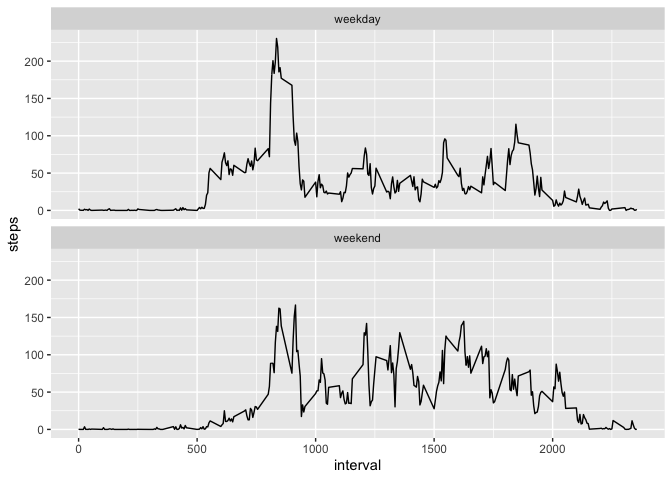

## Notice

As it can be expected that the readership of this document is well informed
about the purpose and the scope of the document we will pass introductions and
proceed to the bread and butter of the assignment.

It seems that due to the version changes in R component ecosystem two files are
not in location mentioned by the submission instructions:
- R did not produce the intermediate file PA1_template.md even with the option 
"clean = FALSE". Hence the file is not included here.
- R stored the figures in to a different directory. The directory "figure" was 
manually created and figure files were copied there.

## Prepare, read, and summarize data


```r
if(! file.exists('activity.csv')) {
    unzip('activity.zip')
}
data <- read.csv('activity.csv', header = TRUE)
summary(data)
```

```
##      steps            date              interval     
##  Min.   :  0.00   Length:17568       Min.   :   0.0  
##  1st Qu.:  0.00   Class :character   1st Qu.: 588.8  
##  Median :  0.00   Mode  :character   Median :1177.5  
##  Mean   : 37.38                      Mean   :1177.5  
##  3rd Qu.: 12.00                      3rd Qu.:1766.2  
##  Max.   :806.00                      Max.   :2355.0  
##  NA's   :2304
```

## Transform date column

Apparently the date column's data type chr and therefore we need to transform it
to date format.


```r
data$date <- as.Date(data$date, "%Y-%m-%d")
str(data)
```

```
## 'data.frame':	17568 obs. of  3 variables:
##  $ steps   : int  NA NA NA NA NA NA NA NA NA NA ...
##  $ date    : Date, format: "2012-10-01" "2012-10-01" "2012-10-01" ...
##  $ interval: int  0 5 10 15 20 25 30 35 40 45 ...
```

## Mean total number of steps taken per day

We will next calculate total steps per day and plot histogram of daily totals 
and report the mean and the median of daily totals.


```r
dailyTotals <- aggregate(data$steps, by = list(data$date), FUN = sum, 
                         na.rm = TRUE)
names(dailyTotals) <- c("Date", "Steps")
with(dailyTotals, hist(Steps, breaks = 10, main = "Histogram of steps per day"))
```


```r
mean(dailyTotals$Steps)
```

```
## [1] 9354.23
```

```r
median(dailyTotals$Steps)
```

```
## [1] 10395
```

## The average daily activity pattern

The subject seem to start his/her activities quite early, at around 5/6 AM. The 
active period ends at around 8 PM.

The average daily activity peak happens at around 9 AM. There is no similar peak
during the afternoon and therefore one might guess that the morning peak is 
rather physical exercise than walking to work/school.

The peak activity interval is 8:35.


```r
intervalAverages <- aggregate(data$steps, by = list(data$interval), 
                              FUN = mean, na.rm = TRUE )
names(intervalAverages) <- c("Interval", "Steps")
with(intervalAverages, plot(Interval, Steps, type = "l", main = "Average steps per interval"))
```


```r
intervalAverages[which.max(intervalAverages$Steps),]
```

```
##     Interval    Steps
## 104      835 206.1698
```

## Missing values

Looking at the summary of our data, we noticed that there are 2304 NA's in the 
Steps column. We decided to impute NAs with interval averages and redo the
histogram and mean values.

After imputing the NAs we noticed that while the left skewness remains the
fake zero values from NAs is distributed along the x-axis. The mean and median
are now exactly same.


```r
newData <- data
newData$steps <- ifelse(is.na(newData$steps), intervalAverages[which(intervalAverages$Interval == intervalAverages),]$Steps, newData$steps)
dailyTotals <- aggregate(newData$steps, by = list(newData$date), FUN = sum, 
                         na.rm = TRUE)
names(dailyTotals) <- c("Date", "Steps")
with(dailyTotals, hist(Steps, breaks = 10, main = "Histogram of steps per day"))
```


```r
mean(dailyTotals$Steps)
```

```
## [1] 10766.19
```

```r
median(dailyTotals$Steps)
```

```
## [1] 10766.19
```

## Differences in activity patterns between weekdays and weekends

Furthermore we wanted to compare activity patterns between weekdays and 
weekends.

Below we split the the data on weekday/weekend, average the interval steps over
this grouping, and plot the timeline of steps.

The resulting plot reveals a more relaxed weekend pattern. While activity 
during the week starts quite sharp right after 5 AM, in weekend mornings the 
activity level rises more gently, reaching typical daytime activity level at 
around 7 AM. Also, the weekend activity from 8 to 9:30 is closer to activity
level throughout the day; perhaps, if our guess about physical exercise is 
correct, then the subject does not exercise weekend mornings. As our final 
observation we note that during weekend nights, the level of activity stays 
higher until at around 10 PM.

```r
newData$day <- ifelse(weekdays(newData$date) == "Saturday" | weekdays(newData$date) == "Sunday", "weekend", "weekday")
newData$day <- as.factor(newData$day)
intervalAverages <- aggregate(newData$steps, by = list(newData$interval, newData$day), FUN = mean)
names(intervalAverages) <- c("interval", "day", "steps")
library(ggplot2)
ggplot(data = intervalAverages, aes(interval, steps)) + geom_line() + facet_wrap(~ day, dir = 'v')
```


